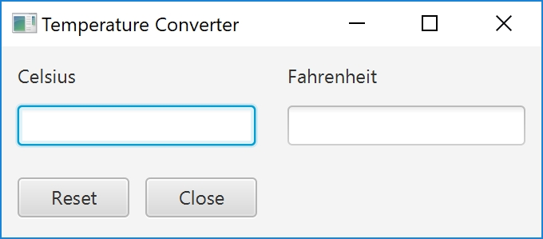
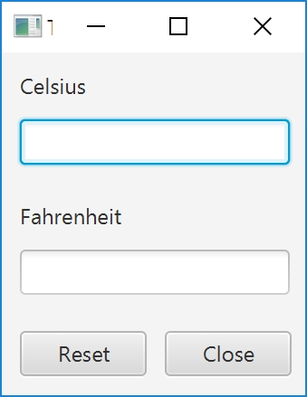

Programmation Java @ Et3
<br>
Polytech Paris-Saclay | 2020-21

___

# Rattrapage

Le but de ce TP est de créer un programme de conversion de températures.

<br><div align="center"></img></div><br>

1. Créez un projet javaFX.

> Dans Eclipse, allez dans *File* > *New* > *Project...* et selectionnez *JavaFX Project*, dans le répertoire "JavaFX".

> Dans IntelliJ, allez dans *File* > *New* > *Project...* et selectionnez *JavaFX Application*, dans l'onglet "JavaFX".

2. Créez une interface, la plus proche possible de la figure ci-dessus. **Vous DEVEZ réaliser cette interface avec *SceneBuilder***.

> L'interface devra contenir :
> 
>   - deux titres (cf. [*Label*](https://docs.oracle.com/javase/8/javafx/api/javafx/scene/control/Label.html)), "Celsius" et "Fahrenheit";
>   - deux champs de texte (cf. [*TextField*](https://docs.oracle.com/javase/8/javafx/api/javafx/scene/control/TextField.html)), pour entrer et afficher des températures;
>   - deux boutons (cf. [*Button*](https://docs.oracle.com/javase/8/javafx/api/javafx/scene/control/Button.html)), "Close" (pour fermer l'application) et "Reset" (pour vider les champs de texte).
>   
> Pour lier votre interface à votre application, vous pourrez, si vous en avez besoin, utiliser la méthode suivante, qui permet de créer le contrôleur du fichier FXML avant son initialisation : 
> ```Java
> public class Main extends Application
> {
>   @Override
>   public void start(Stage primaryStage)
>   {
>     //On crée le modèle
>     Model modele = new Model();
>     
>     //On crée le contrôleur
>     Controller controlleur = new Controller();
>     
>     //On crée la vue, qui aura le contrôle du fichier FXML
>     View vue = new View();
>     
>     try
>     {
>       //On prépare le fichier FXML
>       FXMLLoader loader = new FXMLLoader(getClass().getResource("view.fxml"));
>       
>       //On définit la vue comme contrôleur de ce fichier
>       loader.setController(vue);
>       
>       //On charge le fichier FXML, il appellera la méthode *initialize()* de la vue
>       Parent root = loader.load();
>       
>       //On crée la scène
>       Scene scene = new Scene(root);
>       
>       //On définit cette scène comme étant la scène de notre première fenêtre
>       primaryStage.setScene(scene);
>       
>       //On rend cette fenêtre visible
>       primaryStage.show();
>     }
>     catch(Exception e)
>     {
>       e.printStackTrace();
>     }
>   }
>   
>   public static void main(String[] args) 
>   {
>     launch(args);
>   }
> }
> ```

3. Assurez-vous que les éléments graphiques sont correctement alignés et que leurs positions sont cohérententes avec la photo suivante lorsque vous changez la taille de la fenêtre.

<br><div align="center"></img></div><br>

4. Créez un `textFieldCListener` qui réalise les actions suivantes si l'utilisateur appuie sur la touche *ENTRÉE*, alors que le focus est sur textFieldC :

 - lire la valeur indiquée dans le champs de texte correspondant à la valeur en *Celsius*;
 - transformer cette valeur en float (attention à la gestion des exceptions !);
 - convertir cette valeur en *Fahrenheit*;
 - écrire cette nouvelle valeur dans le champs de texte correspondant à la valeur en *Fahrenheit*.

    Associez le `textFieldCListener` au champs de texte correspondant à la valeur en *Celsius*.
    
    Faites de même pour les *Fahrenheit* (`textFieldFListener`).

6. Créez un `buttonCloseListener` qui quitte l'application . Associez-le au bouton *Close*.

7. Créez un `buttonResetListener` qui vide les deux champs de texte. Associez-le au bouton *Reset*.

___

**BARÈME DU TP :**

- Application [1 pt]
> L'application se lance sans erreurs.
- Interface [5 pts]
> L'interface ressemble à celle présentée. Les éléments graphiques utilisez sont choisis intelligemment.
- Fonctionnalités de base [6 pts]
> Les fonctionnalités énoncées dans le sujets sont implmementées et fonctionnent correctements.
- Modèle - Vue - Contrôleur [6 pts]
> Les classes créers sont clairement divisées en trois parties selon le pettern [Modèle - Vue - Contrôleur](https://baptiste-wicht.developpez.com/tutoriels/conception/mvc/).
- Lisibilité [2 pts]
> Le code est lisible, correctement indenté et commenté.

___

**RENDU DU TP :**

Le TP devra être rendu sous la forme d'une archive zippée (.ZIP) contenant les sources (*i.e.* le code du projet) et les ressources (*e.g.* le fichier .FXML) de votre projet. Cette archive sera envoyée à l'adresse [*polytech.ihm.et3@gmail.com*](mailto:polytech.ihm.et3@gmail.com) avec le sujet "[Rattrapage] Prénom NOM".

